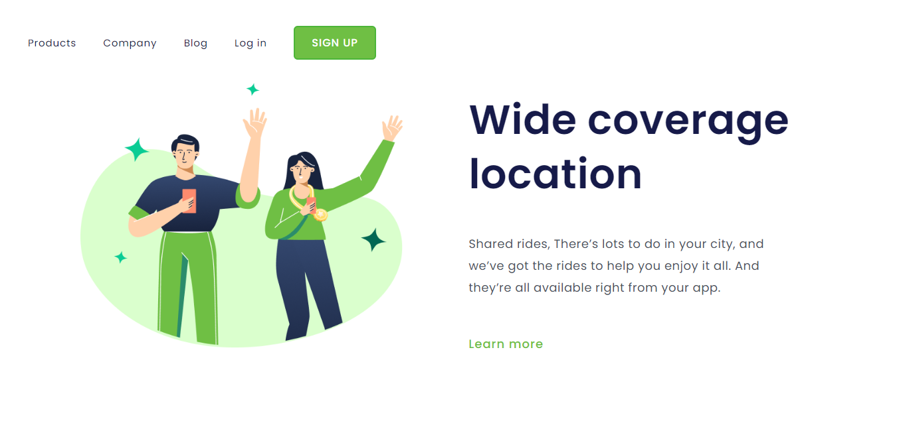
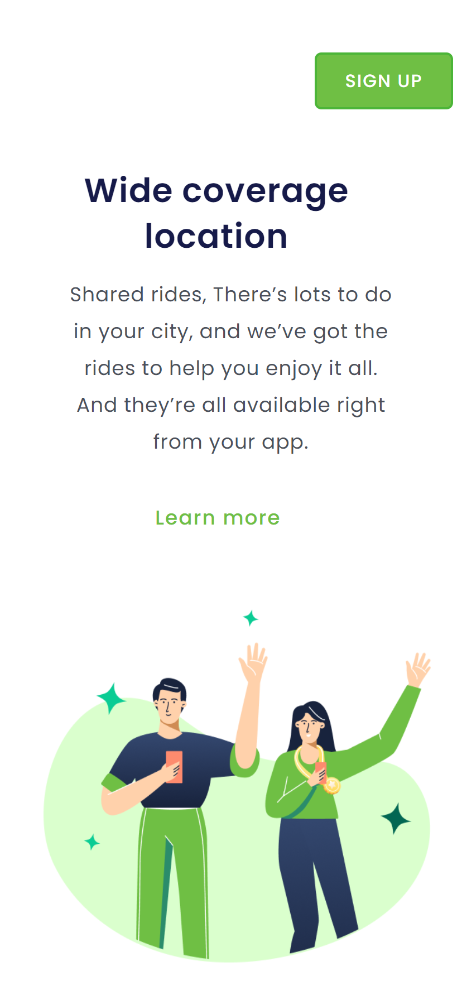

# Location

Desafio de código desenvolvido durante o módulo Front-End da formação Full Stack Dev Club. Projeto desenvolvido com HTML e CSS.

### Versão para Desktop

### Versão para Mobile

    

## Tecnologias

- HTML
- CSS
- Git and Github
